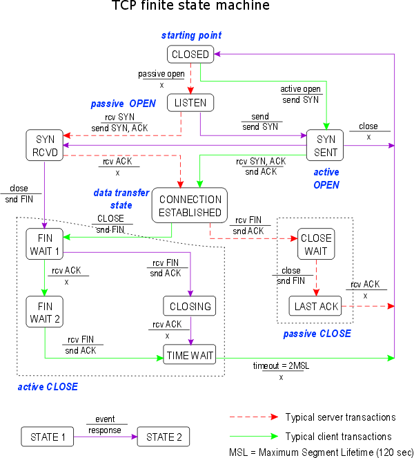

# Tugas Pemograman Jaringan 1

### TCP Finite State Machine

Gambar diatas dapat diketahui bahwa gambar tersebut merepsentasikan sebuah model logic dari perilaku sebuah sistem yang memiliki kondisi internal berubah dengan terjadinya peristiwa yang spesifik.
 
Dari gambar tersebut kotak mewakili sebuah mesin dan panah merepsentasikan transisi dari satu _state_ ke _state_ yang lainnya. Dengan panah yang berwarna hijau menandakan **_normal client transitions_**, panah berwarna merah putus - putus menandakan **_normal server transitions_**.

### For dan If / else

") 

Dari source code diatas ketika dijalankan, untuk sintak for akan menampilkan output :

cara kerja dari sintak for diatas adalah pertama menginisialisasi variable **i** dan **j**, lalu menentukan kondisi perulangan (for), jika kondisi true maka kode yang berada dalam kurung kurawal akan diekseskusi jika kondisi false maka perulangan akan berakhir atau berpindah ke perulangan berikutnya, lalu kata kunci **_Break_** digunakan untuk mengakhiri perulangan dan **_continue_** digunakan untuk melanjutkan perulangan.

untuk sintak if/else akan menampilkan output :

cara kerja dari sintak if/else diatas adalah if tidak memerlukan kurung buka dan kurung tutup jika hanya untuk mengecek 1 kondisi saja, namun jika lebih dari 1 kondisi (menggunakan “&&” atau “||”) maka diperkenankan untuk menggunakan kurung buka dan kurung tutup.
kurung kurawal buka berada 1 baris dengan statement terakhir dari if tersebut.

### Array dan Function

 

untuk sintak array akan menampilkan output :

pada sintak diatas var **a** merupakan array yang memiliki panjang 5 dengan array index ke-4 diisi dengan nilai 100, lalu untuk variable **b** merupakan array dengan pajang 5 dan diisi dengan nilai 1 - 5. untuk variable twoD merupakan array 2 dimensi dengan dimensi 2x3.

untuk sintak function menampilkan output :

pada sintak func diatas merupakan sebuah fungsi. Fungsi di Golang di awali dengan kata kunci “func”dan diikuti nama fungsi lalu parameter dan return type. pada fungsi plus akan mengembalikan nilai a+b dan fungsi plusplus akan mengembalikan nilai a+b+c

### Struct dan Method

 

untuk struct menampilkan output :

pada sintak struct kita dapat mengelompoknya beberapa tipe dari menjadi 1 tipe data dan nantinya struct akan menjadi tipe data baru yang bisa kita pakai dan sesuaikan dengan kebutuhkan kita.

untuk method menampilkan output :

Method adalah fungsi yang hanya dapat dipanggil dari/oleh instance sebuah type. Method hampir sama dengan fungsi hanya saja ditambahkan recievernya yaitu sebuah type. Type disini bisa berupa apa saja. Fungsi area dan perim diatas adalah method.

### Multiple return dan command line

 

Gambar multiple return menampilkan output :

pada gambar multiple return terdapat fungsi vals yang akan mengembalikan nilai 3 dan 7. pada main terdapat variable a,b,c yang di inisialisasi dari nilai balikan dari fungsi vals. 

Gambar command line menampilkan output :

 

### Simple web application

pada gambar diatas menampilkan output :

pada gambar simple web application terdapat fungsi http.HandleFunc() yang digunakan untuk registrasi rute dan handler-nya, sedangkan fungsi http.ListenAndServe() digunakan untuk menjalankan server.

