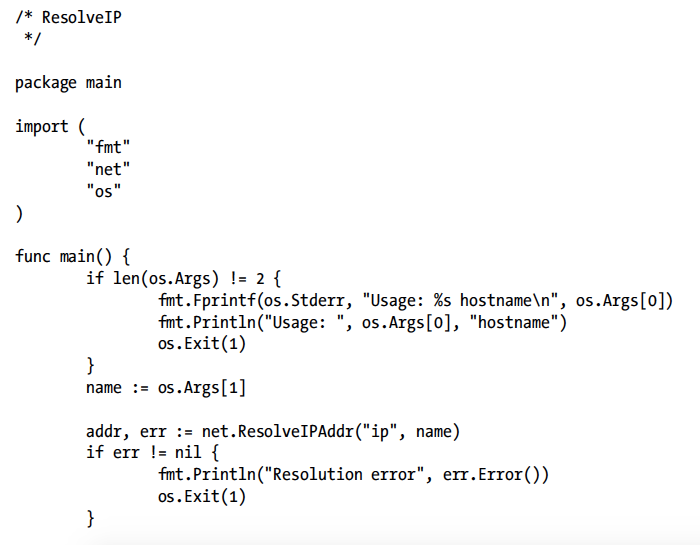
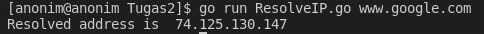
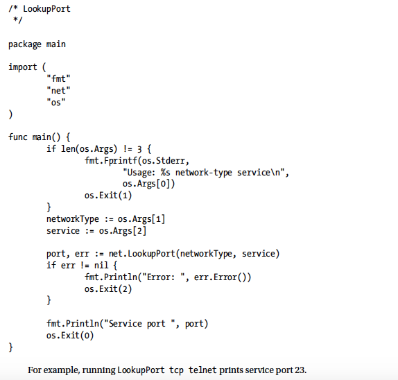
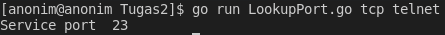
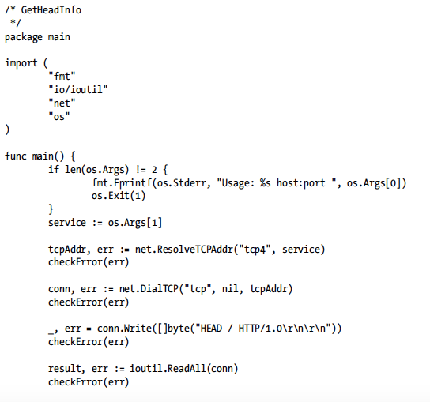
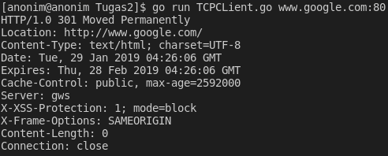
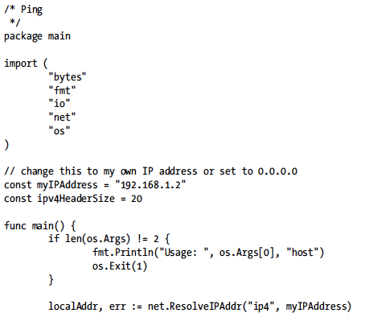
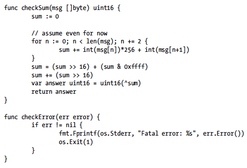
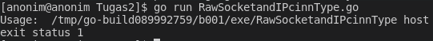

## TUGAS 2 PEMROGRAMAN JARINGAN

### ResolveIP

Code Program :

Hasil Output :

FSM diagram :

### Lookup Port

Code Program :

Hasil Program :

FSM diagram :

### TCP Client

Code Program :

Hasil Program :

FSM Diagram :

### Raw Sockets and The IPConn Type

Code Program :

 

Hasil Program : 

FSM Diagram :

