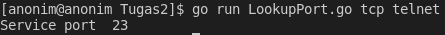
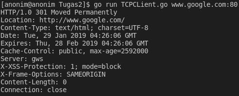
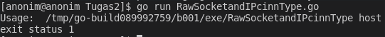

## TUGAS 2 PEMROGRAMAN JARINGAN

### ResolveIP

Code Program :

Hasil Output :

FSM diagram :
               "On Progress"

### Lookup Port

Code Program :

Hasil Program :

FSM diagram :
                "On Progress"

### TCP Client

Code Program :

Hasil Program :

FSM Diagram :
              "On Progress"

### Raw Sockets and The IPConn Type

Code Program :

 

Hasil Program : 

Cara kerja code diatas:
                        Program di atas digunakan untuk mengeping suatu host

### Multi-Threaded Server

Code Program :

Hasil Program :

 Tidak bisa running

### Multi-Threaded Client

Code Program :

Hasil Program :

 Tidak bisa running

