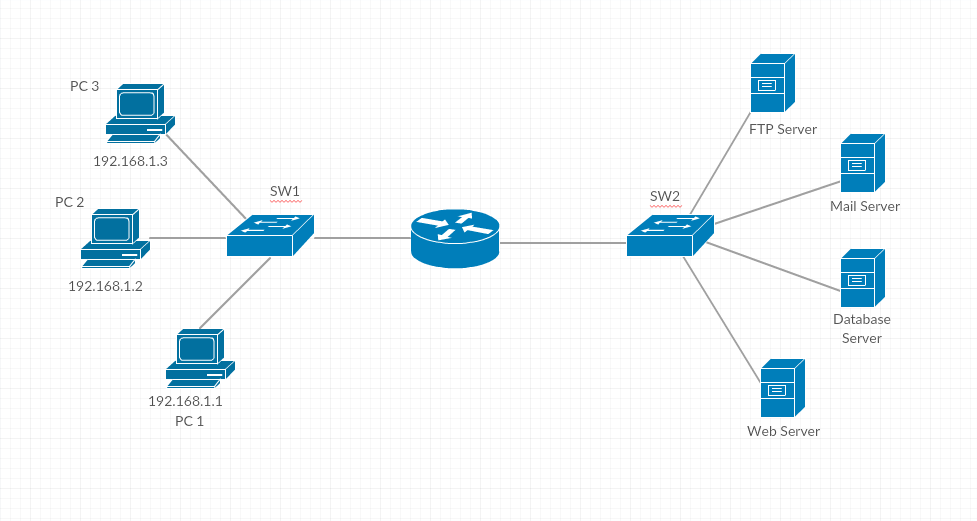

#### Kelompok 4
##### Anggota : 
##### Faishol Muzaky - 1301160369
##### Hatami Rais Bukhari - 1301154303
##### Adetya Ika - 1301164105

# Network Planning

1. Proses Bisnis yang kami terapkan pada proses bisnis jual-beli pada perusahaan E-commerce.

2. Hasil analisis mengapa kami membutuhkan web server, database server, FTP server, mail server, dan server monitoring. adalah sebagai berikut :

    - Web Server : sebagai komunikasi penghubung antara client dengan website jual-beli dari perusahaan e-commerce .
    - Database : Untuk menyimpan data transaksi jual-beli dan data barang di website jual-beli dari perusahaan e-commerce.
    - Mail server : Agar perusahaan e-commerce dapat terus mengirim email, dengan menggunakan email server dari perusahaan itu sendiri
    - FTP server : tujuan FTP server di perusahaan e-commerce dalam proses bisnis jual-beli adalah untuk mengirim data dari server ke client atau sebaliknya.
    - Server monitoring : Untuk memantau keadaan web server, database, mail server, dan FTP server berjalan dengan semestinya, atau memantau keadaan server seperti CPU usage, Memory consumption, I/O network, dsb.
  
3. Untuk orang yang terlibat dalam proses instalasi dan maintenance jaringan adalah seorang enggineer pada bidang instalasi dan maintenance tersebut. Bisa seseorang dalam perusahaan yang sudah bersertifikat dalam hal itu.

# Network Topolgy

Gambaran Topologi pada proses jual-beli yang kami buat adalah sebagai berikut :

Pada gambar topologi diatas terdapat webserver, database server, mail server, FTP server, 
Serta terdapat workstation untuk mengakses webserver berbasis web. Mail server digunakan untuk mengirim email, FTP server untuk mengirim data dari server ke client atau sebaliknya, dan database server Untuk menyimpan data transaksi jual-beli dan data barang di website jual-beli. 
