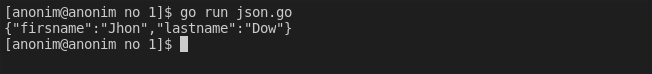
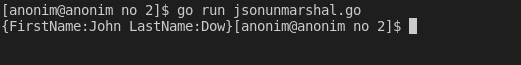
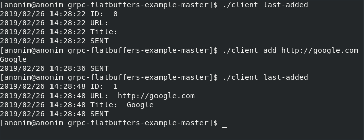
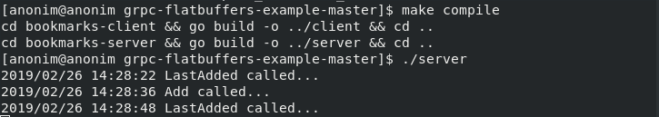
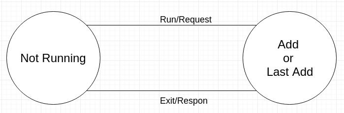
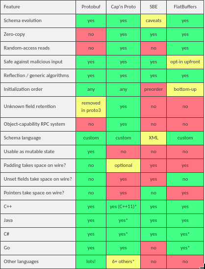

#### Kelompok 4
##### Anggota : 
##### Faishol Muzaky - 1301160369
##### Hatami Rais Bukhari - 1301154303
##### Adetya Ika - 1301164105

# JSON Marshal & Unmarshal

Json (JavaScript Object Notation) merupakan notasi standar yang umum digunakan untuk komunikasi data via web. Bahasa Go menyediakan package ***encoding/json*** yang berisikan banyak fungsi untuk kebutuhan operasi json.

Fungsi ***json.Marshal*** digunakan untuk decoding data ke json string. diberikan code sebagai berikut :

Pada *code* sebelumnya, ***type Person struct*** dikonversi kedalam bentuk json string. Hasil konversi berupa []bytes, lalu dicasting terlebih dahulu ke tipe string agar bisa ditampilkan bentuk json string-nya seperti output :

Fungsi ***json.Unmarshal*** digunakan untuk mengkonversi json string menjadi bentuk objek. diberikan code sebagai berikut :

Pada *code* di atas, ***json*** dikonversi kedalam bentuk objek. Hasil konversi berupa []bytes, lalu dicasting terlebih dahulu ke tipe []byte, karena fungsi ***json.Unmarshal*** hanya menerima data bertipe []byte. Dalam fungsi json.Unmarshal, variabel penampung hasil decode harus di-pass dalam bentuk pointer, contohnya seperti **&p**. seperti output :

# Flatbuffers dan Protocol Buffer

Contoh program gRPC Flatbuffer bisa di download pada repository github berikut : https://github.com/jonog/grpc-flatbuffers-example

Screenshoot output contoh program gRPC Flatbuffer :

- Client 
    

        
    

- Server
  

    

Finite State Machine gRPC :

    

Dari gambar tersebut, gRPC adalah RPC framework buatan google yang gRPC menggunakan RPC untuk transport dan protobuf di bagian antarmuka-nya. Di gRPC, client dapat secara langsung memanggil *methods* pada sebuah aplikasi server pada sebuah mesin yang berbeda seolah-olah sebagai sebuah objek lokal, itu membuatnya lebih mudah untuk membuat aplikasi layanan terdistribusi

Perbedaan protocol buffer dan flatbuffer :

    

