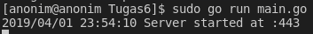

#### Kelompok 4

##### Faishol Muzaky - 1301160369

<br></br>
## Secure Web Server Design

Finite State Machine Web Server :

<p align="center">
  
</p>

cara kerja :

<p align="justify">
Berdasarkan dengan FSM diatas maka, cara kerja dari web server yang kami rancang secara umum, sebagai berikut :
</p>
<p align="justify">
Pada browser meminta data web page kepada server, maka instruksi permintaan data oleh browser tersebut akan dikemas di dalam TCP yang merupakan protokol transport  dan dikirim ke alamat yang dalam hal ini merupakan protokol berikutnya yaitu HTTPS.
</p>
<p align="justify">
Data yang diminta dari browser ke web server disebut dengan HTTPS request kemudian akan dicarikan oleh web server di dalam data server. Jika ditemukan, data tersebut akan dikemas oleh web server dalam TCP dan dikirim kembali ke browser untuk ditampilkan.</p>
<p align="justify">
Data yang dikirim dari server ke browser disebut dengan HTTPS response. Jika data yang diminta oleh browser tersebut tidak ditemukan oleh web server, maka web server akan menolak permintaan tersebut dan browser akan menampilkan notifikasi Page Not Found atau Error 404.
</p>


## Web Server Implementation

saat program dijalankan :
<p align="center">
  
</p>
<br></br>
contoh implemetasi :
<p align="center">
  
</p>
Warning NET::ERR_CERT_AUTHORITY_INVALID muncul karena mengakses sebuah website menggunakan protokol https yang dimana website ini menggunakan self-signed certificate, bukan menggunakan certificate yang sudah diverifikasi oleh CA.
<br></br>

Untuk Menjalankannya :
```{r, engine='bash', count_lines}
go run main.go 
ketika terjadi error panic: listen tcp :443: bind: permission denied
sudo go run main.go
